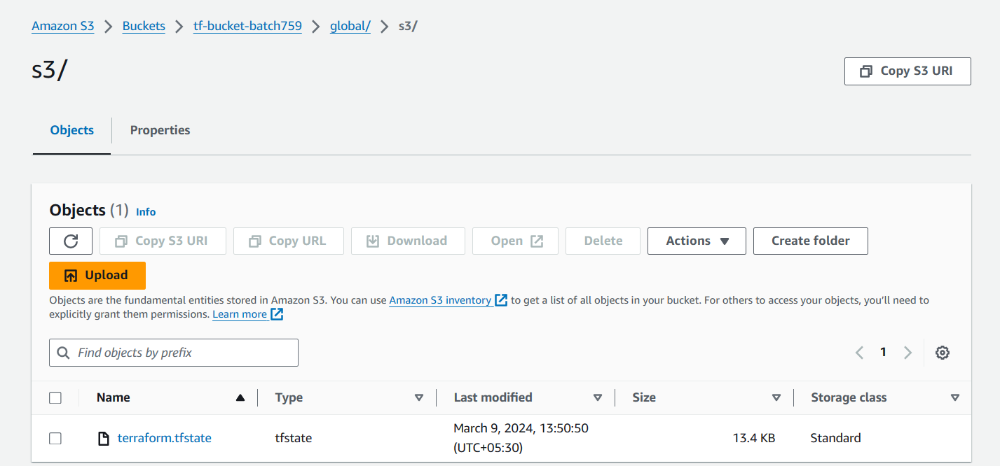
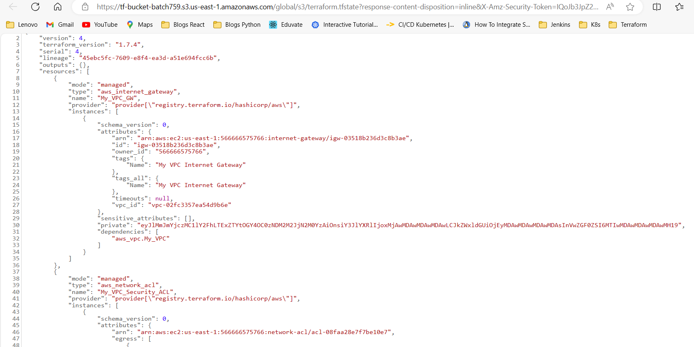
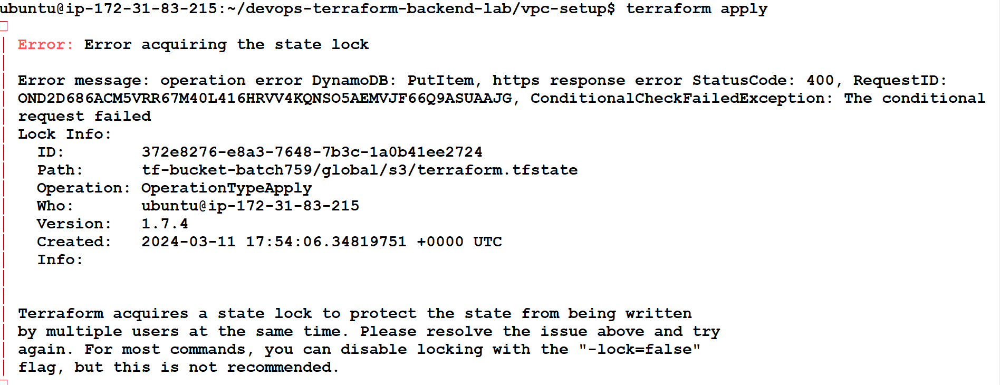

# Terraform Backend : Explained With Hands On Lab

## What is Terraform Backend

In Terraform, a backend is a mechanism used to store the state file produced after running Terraform commands such as terraform apply or terraform plan. The state file contains the current state of your infrastructure as managed by Terraform.

Storing this state file is crucial for Terraform's functionality. It helps Terraform understand what resources it has already created, what changes are pending, and how to reconcile the desired state (defined in your Terraform configuration files) with the actual state of your infrastructure.

Terraform supports various backends, each offering different features and trade-offs. Some common backends include:

Local backend: This is the default backend, where the state file is stored on the local disk where Terraform commands are executed. While this is simple and convenient for development and testing, it's not suitable for collaboration or production environments where multiple users are working on the same infrastructure.

Remote backends: These store the state file remotely, allowing multiple users to collaborate on the same infrastructure. Popular remote backends include:

Amazon S3: State file stored in an S3 bucket.
Azure Blob Storage: State file stored in Azure Blob Storage.
Google Cloud Storage (GCS): State file stored in GCS bucket.
HashiCorp Consul: State file stored in Consul Key/Value store.
HashiCorp Terraform Cloud: A managed service provided by HashiCorp for storing state files and managing Terraform runs.
Remote backends provide features like state locking, which prevents concurrent Terraform runs from modifying the state file simultaneously and potentially causing conflicts.

Choosing a backend depends on factors such as collaboration needs, security requirements, and scalability considerations.

## Pre Steps required to define the terraform backend in AWS

To define a Terraform backend in AWS, you'll typically need to perform the following steps:

Set up an AWS account: If you haven't already, create an AWS account. You'll need this to access AWS services.

Create an S3 bucket: You will use Amazon S3 (Simple Storage Service) to store your Terraform state file remotely.

In Terraform, DynamoDB is often used in conjunction with the S3 backend to provide state locking. State locking prevents concurrent Terraform runs from modifying the state file simultaneously, which could lead to conflicts and inconsistencies in your infrastructure.

When you configure Terraform to use an S3 backend for storing its state file, you have the option to enable state locking using DynamoDB. Here's why it's necessary:

Preventing concurrent state modifications: When multiple users or automation processes are working with the same Terraform configuration, there's a risk of concurrent state modifications. State locking with DynamoDB ensures that only one Terraform run can acquire a lock on the state file at any given time. Other runs wait until the lock is released before proceeding, preventing conflicts.

Ensuring consistency and integrity: By using DynamoDB for state locking, Terraform ensures that the state file remains consistent and intact. This helps prevent race conditions and data corruption that could occur if multiple Terraform runs attempted to modify the state file simultaneously.

Atomicity and reliability: DynamoDB provides atomicity for operations, meaning that state locking operations are either performed entirely or not at all. This ensures reliability and consistency in managing the state file.

In summary, DynamoDB is required in Terraform backend configurations when you want to enable state locking for better management of concurrent Terraform runs and ensure the consistency and integrity of your infrastructure state.

### Lets do all above pre steps requirement using terraform code

1. Clone the repository as shown below to perform the lab in your working directory.

`git clone https://github.com/devops-aws-geek/devops-terraform-backend-lab.git`

2. Go inside the repository "devops-terraform-backend-lab"

`cd devops-terraform-backend-lab`

3. We have defined providers.tf as shown below:

```
terraform {
  required_providers {
    aws = {
      source  = "hashicorp/aws"
      version = "~> 5.0"
    }
  }
}

# Configure the AWS Provider
provider "aws" {
  region = "us-east-1"
  access_key = var.access_key 
  secret_key = var.secret_key
}
```


4. Ensure you have define the AWS access key and secret key in the variables.tf file as shown below:

```
variable "access_key" {
     default = "xxxxxx"
}
variable "secret_key" {
     default = "xxxxxxxx"
}
variable "region" {
     default = "us-east-1"
}
variable "bucket_name" {
     default = "tf-bucket-batch759"
     type    = string
}
variable "table_name" {
     default = "tf-lock-table"
     type    = string
}
```

Replace the mask values witha actual access and secret key. Note: Dont commit this config back to your github repo as active access and secret key should not be commited to remote github repos

Also define your unique S3 bucket name and DynamoDB table name

5. After this you can run terraform commands(init, plan and apply) so that all the resources defined in main.tf file be provisioned.

```
#-----------------------------------------
# s3.tf
#-----------------------------------------
resource "aws_s3_bucket" "state_bucket" {
  bucket = var.bucket_name
}

resource "aws_s3_bucket_public_access_block" "deployment_bucket_access" {
  bucket = aws_s3_bucket.state_bucket.id

  block_public_acls       = true
  block_public_policy     = true
  ignore_public_acls      = true
  restrict_public_buckets = true
}
#-----------------------------------------
# dynamodb.tf
#-----------------------------------------
resource "aws_dynamodb_table" "terraform_locks" {
  name         = var.table_name
  billing_mode = "PAY_PER_REQUEST"
  hash_key     = "LockID"
  

  attribute {
    name = "LockID"
    type = "S"
  }
}
```

`terraform init`

`terraform plan`

`terraform apply`

## Terraform Backend Use Case

### Lets Use the Terraform Backend in the actual Code to Set up a Network Stack (VPC and its related components like subnet, internet gateway, route table, NACL, SG etc )

1. Move to the VPC setup folder

`cd vpc-setup`

2. Define the backend.tf file as shown below

```
terraform {
  backend "s3" {
    bucket         = "tf-bucket-batch759"
    key            = "global/s3/terraform.tfstate"
    region         = "us-east-1"
    dynamodb_table = "tf-lock-table"
    encrypt        = true
  }
}
```

Ensure that you are using the same bucket name and dynamodb table that you had created in the pre steps earlier. Also define the key as path where you want to store your terraform state file

3. Ensure you have define you main  terraform config code files like provider.tf and  variables.tf files

4. We have written the vpc.tf code which is going to provision 8 resources (vpc, subnet, internet gateway, route table, route entry, route_table_association NACL and SG)

5. Execute the below commands to provison the resources as mentioned in the code

`terraform init`

`terraform plan`

`terraform apply`

6. You can check in your AWS account that terrafor state file is generated in the S3 bucket.

terraform state file created as shown in image below:



The sample content in the state file as shown in image below:



7. Check the state locking by running the terraform apply command at the same time from 2 terminals to replicate the locking message for one of the execution.




The lock is managed in teh dynamodb table and released once the running terrafom apply for the first execution is completed.

## Happy Learning!